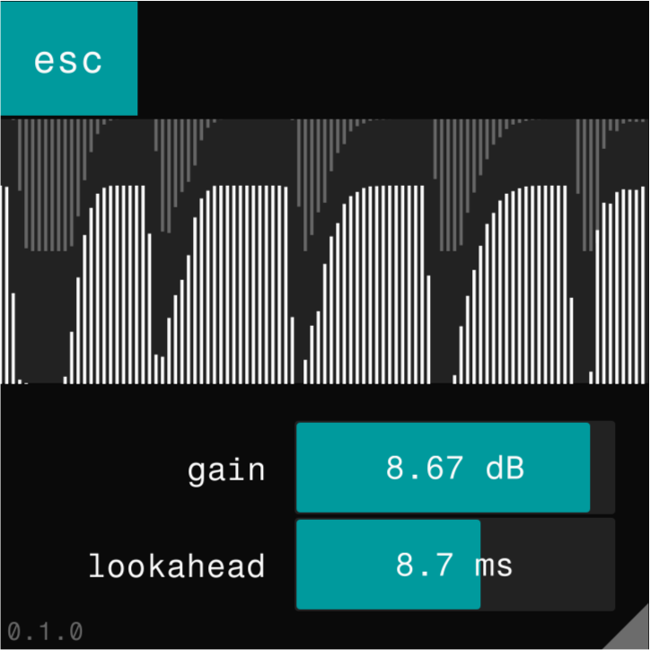

# esc



An envelope-based sidechain ducker, inspired by [Ring Mod Sidechaining Tutorial](https://www.youtube.com/watch?v=OzLEwdcDXWo) and [Track Symbiosis](https://aom-factory.jp/ja/products/track-symbiosis/) by A.O.M.

## Features

- Duck main input signal with the envelope of sidechain input signal.
- Use `gain` to control the level of the detected envelope. Envelope is soft-clipped internally.
- Use `lookahead` to pre-read the sidechain input signal. ([Context](https://youtu.be/16CcS7dj0zs?t=673))
- Resizable interface.

## Building

After installing [Rust](https://rustup.rs/), you can compile esc as follows:

```shell
cargo xtask bundle esc --release
```

Note that in order to compile you must:
- install a rust toolchain `nightly-2022-10-30` (specified in `rust-toolchain.toml`)

## TODO:
- include `Releases` for different platforms
- improve the way plugin allocates ring buffers 
- implement a better envelope-detection algorithm
- fix `gain` parameter being weird
- improve the waveform view

If there are any problems or suggestions or what-not, feel free to open issues or contact me via [my twitter](https://twitter.com/p4thie).

## Licensing
All code is licensed under the [GPLv3](https://www.gnu.org/licenses/gpl-3.0.txt) license.

## Acknowledgements
- [robbert-vdh/nih-plug](https://github.com/robbert-vdh/nih-plug), an audio plugin framework used for making `esc`
- [matidfk/nih-sampler](https://github.com/matidfk/nih-sampler), the original author of `visualizer.rs`, a modified version is used for `esc`
- random people on the internet who gave me some advices and feedbacks
